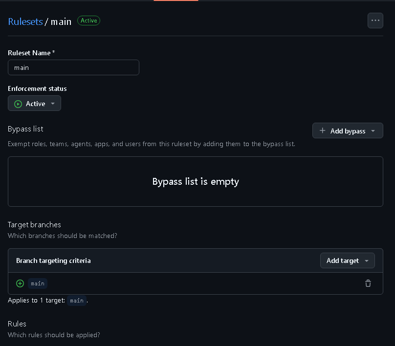
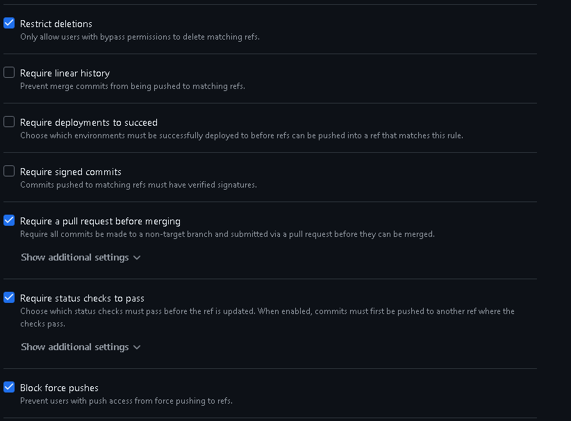
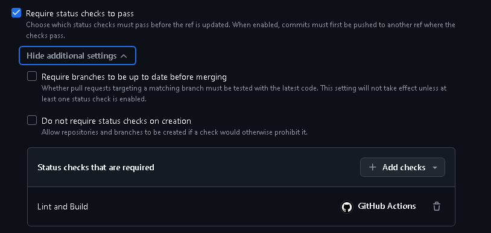

# Currículo Online — DS881 (GRR20242028)

Portfólio/currículo profissional estático desenvolvido para a disciplina
**DS881 — Tópicos Especiais em Tecnologias Emergentes**, aplicando conceitos de
conteinerização (Docker), automação de pipeline CI/CD (GitHub Actions) e
governança de código (Pull Requests + Branch Protection).

## 🔗 Site em produção

**https://felyppe1201.github.io/ds881-curriculo-GRR20242028/**


---

## 🧱 Stack

- **Aplicação:** site estático em HTML + CSS puro
- **Hospedagem:** GitHub Pages
- **Ambiente de dev:** Docker + Docker Compose (`node:alpine` + `live-server`)
- **CI/CD:** GitHub Actions

## 📂 Estrutura

```
.
├── .github/workflows/
│   ├── main.yml          # CI: lint + build (roda em Pull Request)
│   └── deploy.yml        # CD: deploy no GitHub Pages (roda em push na main)
├── src/                  # Código-fonte do site (publicado no Pages)
│   ├── index.html
│   ├── about.html
│   ├── styles/style.css
│   └── assets/           # Imagens
├── Dockerfile            # Imagem do ambiente de desenvolvimento
├── docker-compose.yml    # Sobe o servidor de dev com hot reload
└── .htmlhintrc           # Regras do linter de HTML
```

---

## 🐳 Como rodar localmente com Docker

O ambiente é totalmente conteinerizado: Não precisa instalar Node nem
nenhuma dependência na sua máquina, apenas o Docker.

### Pré-requisitos
- `Docker e Docker Compose instalados`

### Passo a passo para a execução

**1. Clone o repositório e entre na pasta:**
```
git clone https://github.com/felyppe1201/ds881-curriculo-GRR20242028.git
cd ds881-curriculo-GRR20242028
```

**2. Suba o ambiente** (a primeira execução baixa a imagem e instala o servidor de dev)
```
docker compose up --build
```

**3. Acesse no navegador:**
```
http://localhost:8080
```

**4. Hot reload:** Edite qualquer arquivo dentro de `src/` e **salve**. O
navegador recarrega **automaticamente**, sem precisar dar F5 — graças ao
`live-server` combinado com o bind mount do código-fonte.
Recomendo editar as cores no root do styles/style.css, as mudanças são mais visíveis.

**5. Para encerrar:**
Ctrl + C no terminal, depois:
```
docker compose down
```

> **Porta 8080 ocupada?** O servidor é mapeado para a porta `8080` do host (requisito da disciplina). Se ela já estiver em uso por outro projeto, pare o serviço conflitante antes de subir o container.

---

## ⚙️ CI/CD (GitHub Actions)

O pipeline está dividido em dois workflows:

- **`main.yml` (CI):** roda a cada **Pull Request** — faz o **lint** do HTML
  (`htmlhint`) e o **build** (valida a aplicação). É o status check obrigatório
  para liberar o merge.
- **`deploy.yml` (CD):** roda no **push da `main`** (após o merge) e publica o
  conteúdo de `src/` no **GitHub Pages** automaticamente.

---

## 🔒 Configuração da Branch Protection

A branch `main` é protegida por um **Ruleset** ativo. As capturas abaixo
comprovam a configuração aplicada no GitHub:

**1. Ruleset ativo, mirando a branch `main`:**



**2. Regras habilitadas — exige Pull Request, status checks e bloqueia force push:**



**3. Status check obrigatório para o merge — `Lint and Build`:**



---

## 👤 Autor

**Felyppe Marcelo da Silva** — GRR20242028
[LinkedIn](https://www.linkedin.com/in/felyppe-marcelo-silva/)

